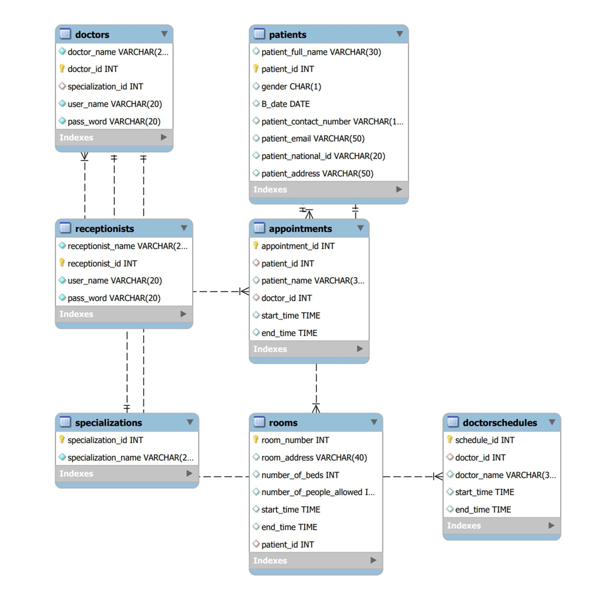
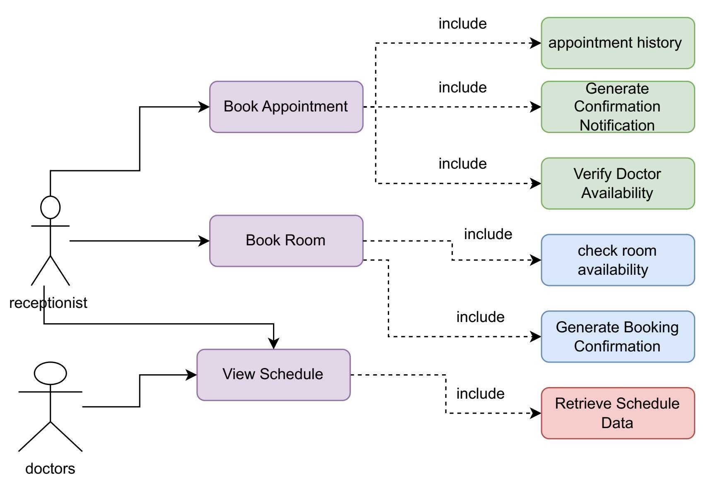
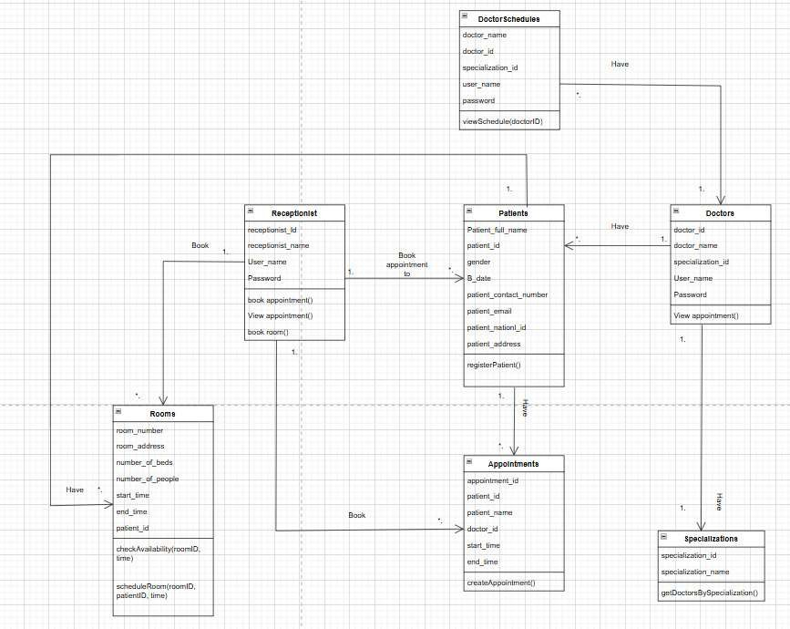
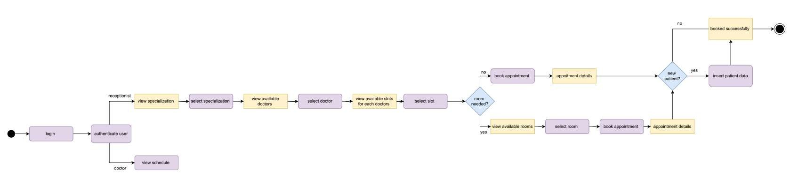
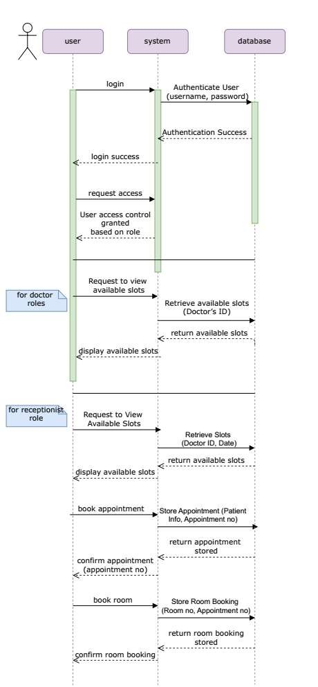
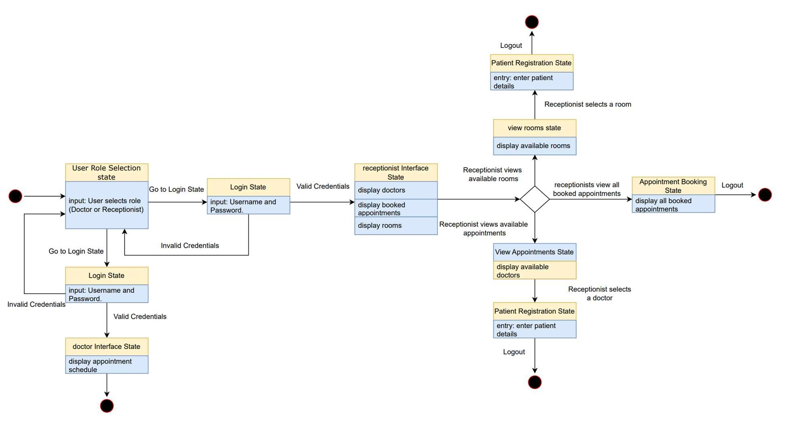
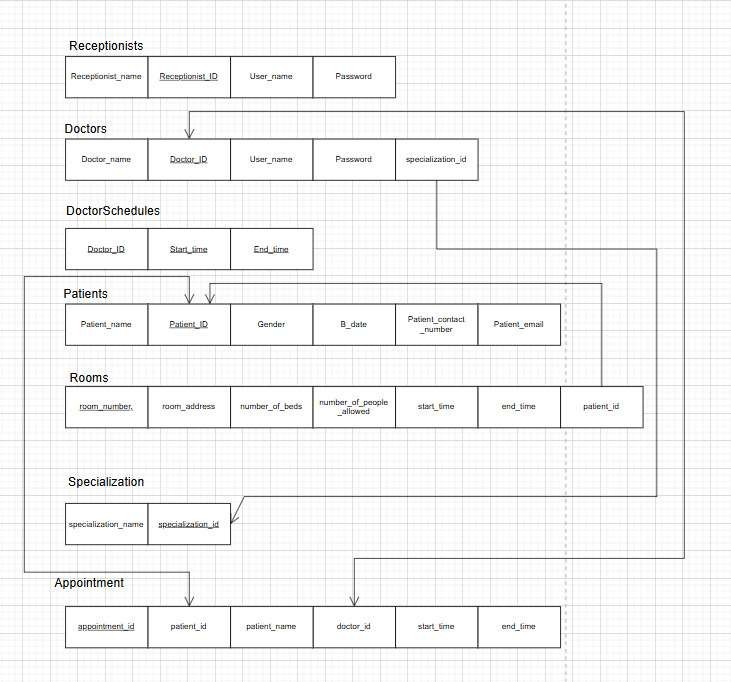

<p align="center">
  
</p>

<p align="center">
  
  
  
  
  
</p>

<p align="center">
  A desktop application that streamlines day-to-day hospital operations — appointment booking,
  patient registration and room management — with separate interfaces for <b>doctors</b> and <b>receptionists</b>.
</p>

---

##  Table of Contents

- [About the Project](#-about-the-project)
- [Features](#-features)
- [Tech Stack](#-tech-stack)
- [Project Structure](#-project-structure)
- [Getting Started](#-getting-started)
- [Demo Accounts](#-demo-accounts)
- [System Design](#-system-design)
- [Known Limitations & Future Work](#-known-limitations--future-work)
- [Team](#-team)
- [License](#-license)

---

##  About the Project

**MBA Hospital** is a Hospital Management System (HMS) built as a second-year mini project for the
**Software Engineering** and **Database Systems** courses at the **Université Française d'Égypte (UFE)**, academic year 2024/2025.

The goal is to automate the administrative side of a hospital: staff log in, the system opens the interface that
matches their role, and from there they can browse doctors by specialization, see schedules, register patients,
book appointments and check room availability. All data is stored in a relational MySQL database.

The full requirements, UML models and database design are documented in the
[Software Requirements Specification (SRS)](docs/SRS-Hospital-Management-System.pdf).
The UI was designed first in [Figma](https://www.figma.com/design/WRiPupgko0FyryjSGBkHWK/Hospital-Management-UI--Community-?node-id=0-1&p=f).

---

##  Features

###  Authentication
- Role selection screen (Doctor / Receptionist)
- Login is checked **only against the selected role** (a receptionist can't log in through the Doctor screen)
- Passwords are stored as **SHA-256 hashes**, never in plain text; the password field is masked
- Logout returns to the role selection screen, and you can log in again as anyone

###  Doctor Interface
- Each doctor sees **only their own** appointments
- Switch between **Today's Appointments** and **All Appointments**

###  Receptionist Interface
- Browse doctors by specialization (loaded from the database) and see their shifts
- Double-click a shift to **book a real appointment**:
  - pick a date and a free **30-minute slot** — booked or past slots are hidden automatically
  - prevents double-booking a doctor or a patient at the same time
- **Find** an existing patient by National ID, or register a new one (with validation)
- View all booked appointments and **cancel** an appointment
- View rooms with total / occupied / free beds
- **Reserve a bed** for a patient and **discharge** patients from a room

---

##  Tech Stack

| Layer | Technology |
|---|---|
| Language | Python 3 |
| GUI | Tkinter, `ttk`, [ttkthemes](https://pypi.org/project/ttkthemes/) (Breeze theme) |
| Images | [Pillow](https://pypi.org/project/Pillow/) |
| Database | MySQL 8 via [mysql-connector-python](https://pypi.org/project/mysql-connector-python/) |
| Design | Figma (UI), MySQL Workbench (ERD), UML diagrams |

---

##  Project Structure

```
hospital-management-system/
├── Choose.py                 # ▶ Entry point – role selection & login
├── screen_doctor1.py         # Doctor dashboard
├── screen_receptionist.py    # Receptionist dashboard
├── db.py                     # All SQL queries & business rules
├── ui_helpers.py             # Shared widgets (tables, inputs, images)
├── config.py                 # Database credentials & theme colours
├── Login.py                  # Early standalone login prototype (not used by the app)
├── database.sql              # Schema + sample data
├── requirements.txt          # Python dependencies
├── Images/                   # Logo, illustration and icons used by the UI
└── docs/
    ├── SRS-Hospital-Management-System.pdf
    ├── banner.png
    └── diagrams/             # ERD, UML and relational schema
```

---

##  Getting Started

### Prerequisites

- **Python 3.8+** with Tkinter
  (included on Windows/macOS; on Debian/Ubuntu run `sudo apt install python3-tk`)
- **MySQL Server 8.x**
- *(Recommended)* the **Roboto** font installed, and a **1920×1080** screen — the layout uses fixed positions

### 1. Clone the repository

```bash
git clone https://github.com/<your-username>/hospital-management-system.git
cd hospital-management-system
```

### 2. Install dependencies

```bash
python -m venv venv
# Windows: venv\Scripts\activate   |   macOS/Linux: source venv/bin/activate
pip install -r requirements.txt
```

### 3. Set up the database

```bash
mysql -u root -p < database.sql
```

Or open `database.sql` in **MySQL Workbench** and run it (⚡).
This creates the `hospital` database with all tables and sample data.

>  The script drops and recreates the `hospital` database, so re-running it resets all data.

### 4. Configure the database connection

Open `config.py` and set your MySQL password — it's the only place the credentials live:

```python
DB_CONFIG = {
    "host": "localhost",
    "user": "root",
    "password": "1234",      # ← change to your MySQL password
    "database": "hospital",
}
```

### 5. Run the application

```bash
python Choose.py
```

---

##  Demo Accounts

`database.sql` creates these ready-to-use accounts. On the first screen, choose the **matching role**
before logging in, because a doctor account won't work on the Receptionist login and vice versa.

###  Doctors

| Name | Specialization | Username | Password |
|---|---|---|---|
| Dr. John Smith | Cardiology | `johnsmith` | `password123` |
| Dr. Emily Davis | Neurology | `emilydavis` | `securepass456` |
| Dr. Michael Brown | Dentistry | `michaelbrown` | `mypassword789` |

###  Receptionists

| Name | Username | Password |
|---|---|---|
| Alice Carter | `alicecarter` | `alicepass123` |
| Bob Martin | `bobmartin` | `securebob456` |
| Chloe Taylor | `chloetaylor` | `chloe789pass` |
| David Wilson | `davidwilson` | `david2023pwd` |

###  Sample Patients

Type one of these National IDs and press **Find** to load an existing patient:

| Name | National ID |
|---|---|
| Ethan James | `123456789` |
| Sophia Miller | `987654321` |
| Liam Johnson | `543216789` |
| Olivia Brown | `112358132` (already staying in room 101) |

###  Quick Test Checklist

1. Choose **Doctor** and log in as `johnsmith`. You should see only Dr. Smith's appointments.
2. Log out, choose **Doctor** again and try `alicecarter`. The login should be rejected, since she is a receptionist.
3. Choose **Receptionist** and log in as `alicecarter`.
4. Go to **Doctors → Cardiology** and double-click a shift. Press **Show Free Slots** (if today's shift is already over, change the date to tomorrow), then **Find** patient `123456789` and press **Book**.
5. Open **Booked Appointments** to see the new booking, then select it and try **Cancel Selected**.
6. Go to **Rooms**, double-click room **102**, find patient `987654321` and press **Reserve**. Then select her in the table and press **Discharge**.
7. Log out, log in as `johnsmith` again, and open **All Appointments** to confirm the new booking appears.

>  These are demo credentials for local testing only. Passwords are stored as SHA-256 hashes in the database.
> Re-running `database.sql` resets all data back to these samples.

---

##  System Design

### Entity Relationship Diagram
<p align="center"></p>

### Database Tables

| Table | Purpose |
|---|---|
| `specializations` | Medical departments (Cardiology, Neurology, Dentistry) |
| `doctors` | Doctor profiles and login credentials |
| `doctorschedules` | Doctors' working shifts (appointment slots are generated inside them) |
| `receptionists` | Receptionist profiles and login credentials |
| `patients` | Registered patient information |
| `appointments` | Appointments between patients and doctors, with date and time |
| `rooms` | Hospital rooms and their capacity |
| `room_reservations` | Which patient is in which room (check-in / check-out) |

> ℹ️ After the original design, `appointments` gained an `appointment_date` column and room
> assignments moved to the new `room_reservations` table so rooms can hold several patients.
> The diagrams below show the original design from the SRS.

<details>
<summary><b> More UML diagrams (click to expand)</b></summary>

#### Use Case Diagram
<p align="center"></p>

#### Class Diagram
<p align="center"></p>

#### Activity Diagram – Appointment Booking & Room Registration
<p align="center"></p>

#### Sequence Diagram
<p align="center"></p>

#### State Machine Diagram
<p align="center"></p>

#### Relational Schema
<p align="center"></p>

</details>

---

##  Known Limitations & Future Work

- [x] Role-specific login
- [x] Doctors only see their own appointments
- [x] Real appointment booking with free-slot detection
- [x] Room reservations with check-in / discharge
- [x] Hashed passwords
- [x] Database credentials in a single `config.py`
- [ ] Salted password hashing (e.g. bcrypt) instead of plain SHA-256
- [ ] Edit patient details from the UI
- [ ] Admin screen to add doctors, receptionists, shifts and rooms
- [ ] Responsive layout for screen sizes other than 1920×1080

---

This project is licensed under the [MIT License](LICENSE).
